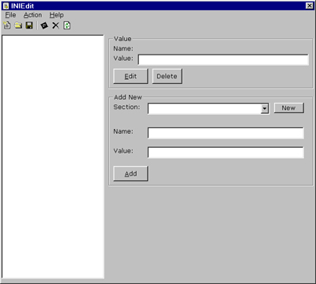



## INI Edit v1\.1

### Description

INIEdit v1.1 is a windows INI Editor. it loads an INI file into a visual interface, allowing you to add and delete sections, keys and values. If you like this project, please vote! I am already working on 2.0!
 
### More Info
 

             |
---                |---
**Submitted On**   |2001-05-25 10:59:26
**By**             |[Will Urbanski](https://github.com/Planet-Source-Code/PSCIndex/blob/master/ByAuthor/will-urbanski.md)
**Level**          |Intermediate
**User Rating**    |3.6 (18 globes from 5 users)
**Compatibility**  |VB 5\.0, VB 6\.0
**Category**       |[Files/ File Controls/ Input/ Output](https://github.com/Planet-Source-Code/PSCIndex/blob/master/ByCategory/files-file-controls-input-output__1-3.md)
**World**          |[Visual Basic](https://github.com/Planet-Source-Code/PSCIndex/blob/master/ByWorld/visual-basic.md)
**Archive File**   |[INI Edit v201065262001\.zip](https://github.com/Planet-Source-Code/will-urbanski-ini-edit-v1-1__1-23480/archive/master.zip)

